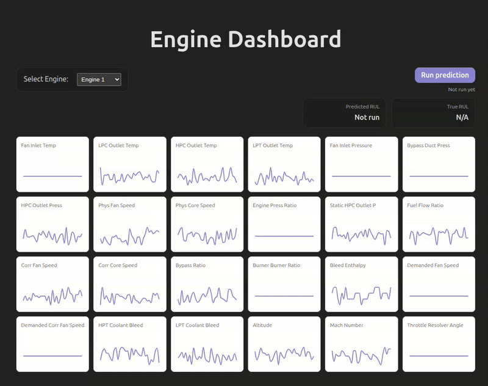

# CMAPSS Jet Engine RUL Prediction

Predict remaining useful life (RUL) of turbofan engines from multivariate sensor telemetry. The goal is to estimate how many cycles remain before failure so maintenance can be scheduled proactively.

Deployed app: https://rul-app-99998513528.europe-west3.run.app/


Caption: Select an engine, run a prediction, and compare predicted vs. true RUL.


Caption: Click a sensor card to open the detailed chart with latest/avg/min/max stats.


Caption: Use the `/docs` API UI to call `/predict/` by providing a `unit_nr`.

## Problem description
Airline and fleet operators need to decide **when to service an engine before failure** based on evolving sensor readings. Each engine operates for many cycles, and sensor patterns gradually degrade as components wear out. The task is to **predict remaining useful life (RUL)** in cycles so maintenance can be scheduled ahead of time, minimizing downtime and avoiding catastrophic failures. The output is a numeric estimate of cycles remaining, plus context (true RUL and delta) to interpret whether the model is over‑ or under‑estimating.

## Dataset
- NASA CMAPSS (Commercial Modular Aero-Propulsion System Simulation) turbofan engine degradation data.
- Each row is one engine cycle with 3 operational settings and 21 sensor measurements.
- Training labels are computed as `max_cycle - time_cycles`; test labels come from `RUL_FD00*.txt`.
- Data will be downloaded into `data/` via notebook or script (train/test/RUL text files and `CMAPSSData.zip`).
- The notebook trains on FD001 by default; the API currently uses FD001 test data.

## Dataset details
- CMAPSS provides multiple subsets (FD001–FD004) with different operating conditions and fault modes.
- Each unit (engine) is a **run‑to‑failure trajectory**; `time_cycles` is the cycle index.
- The model is trained on full trajectories and predicts RUL for a given unit based on its sensor history.

## Approach
- Clean and merge CMAPSS subsets, compute RUL labels, and split by engine id.
- Scale numeric features with MinMaxScaler; store the scaler in `models/scaler.pkl`.
- Drop non-informative sensors: `s_1`, `s_5`, `s_10`, `s_16`, `s_18`, `s_19`.
- Build variable-length sequences per engine and train an LSTM (`model.RulLstm`) with SmoothL1 loss.
- Hyperparameter sweeps are recorded in `tuning_results.txt`.
- Export the best model to `models/lstm_model.pth` and `models/lstm_model.onnx`.
- Serve predictions via a FastAPI web service (similar to Flask).

## Application architecture
- **Data layer**: CMAPSS files in `data/` (train/test/RUL). `train.py` computes RUL labels and fits the scaler on the training split.
- **Notebook layer**: `notebook.ipynb` is the source of truth for EDA, feature selection, and training logic; `train.py` mirrors it.
- **Model layer**: PyTorch LSTM trained on variable-length sequences, exported to ONNX for inference (`models/lstm_model.onnx`).
- **Inference helper**: `predict.py` handles ONNX preprocessing and model invocation used by the API.
- **API layer**: FastAPI (`app.py`) loads ONNX + scaler and exposes `/predict`, `/sensors`, and `/engines`. Inference runs with ONNX Runtime.
- **Frontend**: React dashboard (`sensor-dashboard/`) calls the API to render sensor traces and RUL predictions.
- **Deployment**: Single Docker image builds the frontend and serves it with the API; the same image runs locally or on Cloud Run.

## Why an LSTM
- Sensor readings are **sequences over time**, and RUL depends on degradation trends rather than a single snapshot.
- LSTMs capture temporal dependencies and work well with **variable‑length trajectories**.
- The model can learn progression patterns across sensors without hand‑crafted temporal features.

## Data augmentation (time‑series sampling)
To improve generalization, the training loader uses **random temporal crops**:
- **Variable‑length windows**: each sample is a random subsequence between `l_min` and `l_max`.
- **End‑biased sampling**: crops are sampled with a Beta distribution so later cycles (closer to failure) are seen more often.

## Repository layout
- `data/` - CMAPSS train/test/RUL files and `CMAPSSData.zip`.
- `notebook.ipynb` - end-to-end EDA + training pipeline.
- `train.py` - training + tuning script (mirrors the notebook flow).
- `predict.py` - ONNX inference helper (preprocessing + model call).
- `model.py` - PyTorch LSTM model.
- `dataset.py` - datasets + random-crop loader.
- `app.py` - FastAPI inference API (the actual web service).
- `models/` - model weights, ONNX export, scaler.
- `sensor-dashboard/` - React dashboard for engine and sensor plots.
- `requirements.txt` - full Python dependencies.
- `requirements.infer.txt` - minimal API/runtime dependencies.
- `Dockerfile` - builds UI and serves API.

## Results and model selection
- Evaluation (test set, cycles): **SmoothL1 = 10.8867**, **MAE = 11.3603**, **RMSE = 16.6115**.
- Evaluation (validation SmoothL1, cycles): **best = 5.8699** (trial 32 on FD001 split; see `tuning_results.txt`).
- Model selection: LSTM variants are compared across hidden size, layers, dropout, learning rate, weight decay, and batch size. The final model is chosen by lowest validation loss.
- Best hyperparameters (trial 32):
  `hidden_size=64`, `num_layers=2`, `dropout=0.0`, `lr=0.002`, `weight_decay=1e-4`, `batch_size=32`, `samples_per_epoch=60000`, `l_min=30`, `l_max=200`.
- Model comparison (top 5 trials by validation loss):

| Trial | Val loss (SmoothL1) | Layers | Dropout | LR | Weight decay | Batch size |
| --- | --- | --- | --- | --- | --- | --- |
| 32 | 5.8699 | 2 | 0.0 | 2e-3 | 1e-4 | 32 |
| 19 | 5.9018 | 1 | 0.3 | 2e-3 | 1e-4 | 16 |
| 7  | 6.1156 | 1 | 0.0 | 2e-3 | 1e-4 | 16 |
| 29 | 6.1733 | 2 | 0.0 | 2e-3 | 0.0 | 16 |
| 25 | 6.1906 | 2 | 0.0 | 1e-3 | 0.0 | 16 |
- Search space used in the sweep (all variations tried, **48 total model variants**):
  - `hidden_size`: [64]
  - `num_layers`: [1, 2]
  - `dropout`: [0.0, 0.3]
  - `lr`: [1e-3, 2e-3, 5e-4]
  - `weight_decay`: [0.0, 1e-4]
  - `batch_size`: [16, 32]
  - `samples_per_epoch`: [60000]
  - `l_min`: [30]
  - `l_max`: [200]
- Targets are **not normalized** in `train.py`, so metrics are in raw **cycles**.

## Setup
### 1) Python virtual environment
```
python -m venv .venv
source .venv/bin/activate
python -m pip install --upgrade pip
pip install -r requirements.txt
```

If you only want the API/runtime dependencies:
```
pip install -r requirements.infer.txt
```

### 2) Frontend dependencies
```
cd sensor-dashboard
npm install
```

## Data download
The training script will download and unzip CMAPSS automatically if `data/CMAPSSData.zip` is missing:
```
python train.py
```

Manual download (optional):
```
mkdir -p data
wget https://data.nasa.gov/docs/legacy/CMAPSSData.zip -O data/CMAPSSData.zip
unzip -o data/CMAPSSData.zip -d data/
```

## Training
Train the LSTM (matches the notebook pipeline):
```
python train.py
```

Outputs:
- `models/lstm_model.pth`
- `models/lstm_model.onnx`
- `models/scaler.pkl`

The API expects these artifacts to exist. If they are missing, run `python train.py` to generate them.

To train on different subsets, edit `FD_TAGS`, `search_space`, and `sweep_epochs` in `train.py`.

## Run locally
Before running local predictions (FastAPI or Docker), make sure the CMAPSS data is downloaded into `data/`. You can download it directly (manual download), through the notebook, or via `train.py`.

### API (FastAPI)
```
uvicorn app:app --reload --port 8080
```

Example request:
```
curl -X POST "http://localhost:8080/predict/" \
  -H "Content-Type: application/json" \
  -d '{"unit_nr": 1}'
```

Useful endpoints:
- `GET /engines` -> list engine ids
- `GET /sensors?unit_nr=1&limit=50&start_cycle=0&end_cycle=200`
- `POST /predict/` -> RUL prediction for one engine id

### Frontend dashboard
```
cd sensor-dashboard
npm run dev
```
The Vite dev server runs at `http://localhost:5173` and expects the API at `http://localhost:8080`.

## Using the deployed app
Once the container is running (locally or on Cloud Run), open the root URL in a browser.
Deployed app URL: https://rul-app-99998513528.europe-west3.run.app

Dashboard flow:
- Select an engine from the dropdown.
- Click **Run prediction** to fetch a new RUL estimate.
- **Predicted RUL** is the model’s estimate of remaining cycles until failure.
- **True RUL** is the ground-truth remaining cycles (from `RUL_FD001.txt`).
- **Delta** = predicted − true. Positive means the model overestimates remaining life.
- Click any mini chart to open the detailed view with the full sensor trace and stats.

API docs:
- Interactive Swagger docs are available at `/docs` on the running service (e.g., `http://localhost:8080/docs` or your Cloud Run URL + `/docs`).
- The docs list all endpoints and allow you to submit predictions directly from the browser.
- Deployed docs URL: https://rul-app-99998513528.europe-west3.run.app/docs (try `POST /predict/` there).

Web service deployment notes:
- The backend is a FastAPI service (Flask-like API) and can be run locally or in Docker.
- The same container image is deployed to Google Cloud Run.

## Docker
Build the container (uses the Dockerfile in the repo root):
```
docker build -t rul-app .
```

Run the container locally:
```
docker run --rm -p 8080:8080 -e PORT=8080 rul-app
```
This builds the React UI and serves it alongside the API on `http://localhost:8080`.


## Cloud deployment (Google Cloud Run)
Set your project and region:
```
gcloud config set project YOUR_PROJECT_ID
gcloud config set run/region YOUR_REGION
```

Enable required services (one-time):
```
gcloud services enable run.googleapis.com artifactregistry.googleapis.com cloudbuild.googleapis.com
```

Create an Artifact Registry repo (one-time):
```
gcloud artifacts repositories create rul-repo   --repository-format=docker   --location=YOUR_REGION   --description="RUL app images"
```

Local build:
```
gcloud auth configure-docker YOUR_REGION-docker.pkg.dev

docker build -t YOUR_REGION-docker.pkg.dev/YOUR_PROJECT_ID/rul-repo/rul-app:latest .
docker push YOUR_REGION-docker.pkg.dev/YOUR_PROJECT_ID/rul-repo/rul-app:latest
```

One-command deploy (script):
```
bash scripts/deploy_cloud_run.sh
```
Edit the script if you need a different project, region, repo, or service name.

Deploy to Cloud Run:
```
gcloud run deploy rul-app   --image YOUR_REGION-docker.pkg.dev/YOUR_PROJECT_ID/rul-repo/rul-app:latest   --allow-unauthenticated   --port 8080
```

Fetch the service URL:
```
gcloud run services describe rul-app --format='value(status.url)'
```

## Notes
- The API reads `data/test_FD001.txt`. To serve other subsets, update the file path in `app.py` and retrain/export the model if needed.
